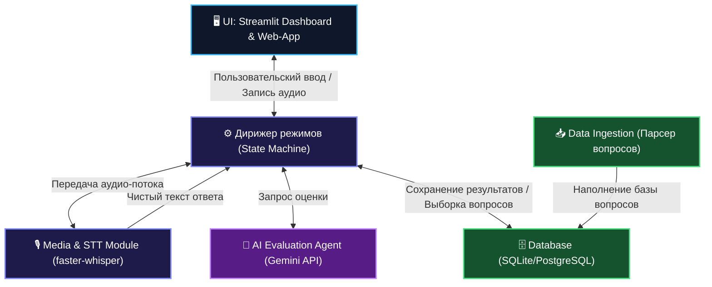
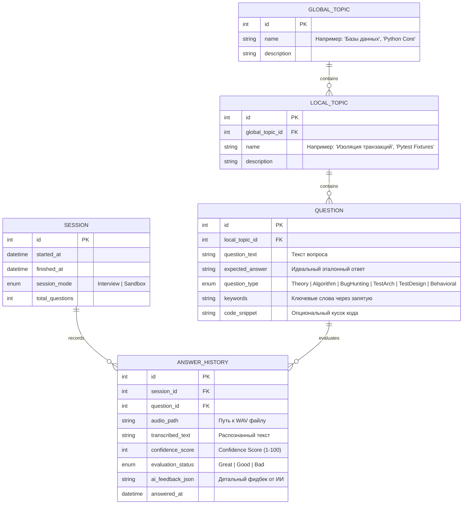

# 🧠 Python SDET Interview Trainer (Middle+ / Senior)

Революционный тренажер для подготовки Python Automation QA / SDET специалистов к техническим интервью уровня Middle+, Senior и TechLead. Проект построен на сочетании современных веб-технологий на Python (Streamlit), локального распознавания речи (STT на базе `faster-whisper`), умной аналитики прогресса по методологии интервального повторения (Spaced Repetition) и интеллектуальной оценки ответов с помощью AI-агентов.

---

## 📊 Текущий статус проекта (Development Status)

В проекте заложен мощный архитектурный фундамент и реализованы ключевые компоненты для работы с базой вопросов и ИИ-генератором. Ниже приведен детальный статус готовности модулей:

| Модуль / Компонент | Статус | Что реализовано / Описание |
| :--- | :---: | :--- |
| **🗄️ База данных (Database)** | ✅ Готово | Схема данных на SQLAlchemy, база данных SQLite, полноценные методы репозитория для CRUD-операций, скрипт сидирования начальных тем и подтем. |
| **🖥️ Базовый UI (Base UI)** | ✅ Готово | Премиальный Streamlit интерфейс в темных тонах с Glassmorphic-дизайном, просмотрщик иерархии тем и вопросов, удаление вопросов, статистика базы в боковой панели. |
| **🔮 Генератор вопросов (AI Generator)** | ✅ Готово | Интеграция с Vertex AI (Gemini), глубокая батч-генерация качественных технических вопросов по выбранным темам и разрешенным типам с автоматическим сохранением в БД. |
| **⚔️ Режимы обучения (Training Modes)** | 🟡 В процессе | Создана стейт-машина сессий, разработан режим «Песочница» (Sandbox MVP) с выбором количества случайных вопросов, устными ответами, кнопкой «Дефектный вопрос?» для пометки/пропуска и записью истории в БД. |
| **🎙️ Аудио-модуль (Media & STT)** | ⏳ В планах | Запись голоса в браузере (Streamlit Audio Recorder) и локальная транскрибация аудио в текст с использованием библиотеки `faster-whisper`. |
| **📈 Оценка и Аналитика (AI Evaluation)** | ⏳ В планах | Агент оценки ответов (Gemini API) с выдачей JSON-фидбека (оценка, сильные/слабые стороны, пробелы), логика интервального повторения (Spaced Repetition) и дашборды Plotly. |

---

## 🛠️ Быстрый запуск (Quick Start)

Для запуска текущей версии приложения (Проводник базы + ИИ-генератор вопросов):

1. **Создайте и активируйте виртуальное окружение**:
   ```bash
   python3 -m venv .venv
   source .venv/bin/activate
   ```

2. **Установите зависимости**:
   ```bash
   pip install -r requirements.txt
   ```

3. **Инициализируйте и наполните базу данных темами**:
   ```bash
   python src/database/seed.py --fresh
   ```

4. **Настройте переменные окружения**:
   Создайте файл `.env` в корне проекта и добавьте учетные данные для доступа к Vertex AI (Gemini API).

5. **Запустите приложение**:
   ```bash
   make run
   ```
   Приложение будет доступно по адресу: [http://localhost:8502](http://localhost:8502)

---

## 🗺️ Общая архитектура системы (High-Level Architecture)

Приложение спроектировано как модульный монолит на Python. Все модули изолированы друг от друга и общаются через строго определенные интерфейсы (API/классы-обертки). Это гарантирует, что в будущем любой модуль (например, UI-слой или STT-движок) можно заменить без переработки бизнес-логики.



---

## 📦 Детальное описание модулей

### 1. Модуль генерации и наполнения (Data Ingestion)
Фундамент приложения, отвечающий за сбор, валидацию и наполнение базы вопросов. Структурирует базу данных для обеспечения гибких выборок (например, *"Сгенерировать интервью, где 70% вопросов — это ситуационные кейсы, а 30% — сухая теория"*).

- **Иерархическая структура**: `GlobalTopic` (Глобальная тема) $\rightarrow$ `LocalTopic` (Подтема) $\rightarrow$ `Question` (Конкретный вопрос).
- **QuestionType**: Тип вопроса задается через строгое перечисление (`Enum`), что позволяет осуществлять гибкую фильтрацию при генерации сессий.
- **Инструменты загрузки**: Поддержка импорта вопросов из YAML/JSON файлов конфигурации для быстрого наполнения базы.

### 2. Модуль работы с аудио (Media & STT)
Полностью изолированный микросервисный слой для обработки голоса. Его единственная задача — транскрибировать аудиозапись ответа в текст с максимальной точностью и минимальной задержкой.

- **Логика работы**: 
  1. Принимает бинарный аудио-поток (WAV/MP3) из интерфейса Streamlit.
  2. Временно сохраняет аудиофайл локально или загружает в S3-совместимое хранилище (опционально).
  3. Передает файл в локальный движок транскрибации `faster-whisper` (используется квантованная модель, например, `small` или `medium` для работы на CPU/GPU).
  4. Возвращает очищенный текст (без фоновых шумов и с базовой пунктуацией) в State Machine.
- **Изоляция**: Модулю безразличен текущий режим интервью. Он работает как чистая функция: `Audio Binary -> Clean Text`.

### 3. Модуль базы данных (Storage & Spaced Repetition)
Хранилище истории ответов, прогресса обучения, весов тем и настроек повторения.

- **Методология Spaced Repetition**: 
  Каждый ответ пользователя получает один из статусов (например, `Great`, `Good`, `Bad`). На основе этого рассчитывается метрика **Confidence Score** (Уровень уверенности) для каждой темы:
  - При оценке `Great` вопрос отправляется в архив и "засыпает" на **3 дня**.
  - При оценке `Bad` вопрос возвращается в активный пул и будет предложен в режиме Песочницы уже через **2 часа**.
- **Метрики**: Накапливает детальную статистику по скорости ответа, количеству пауз и заиканий (STT метаданные) и глубине раскрытия темы.

### 4. Модуль UI (Streamlit Web-Interface)
Интерактивный, визуально привлекательный дашборд и рабочая область тренажера на чистом Python.

- **Преимущества перехода с Telegram на Streamlit**:
  - Полноценные интерактивные графики (Plotly) для дашборда уверенности прямо из коробки.
  - Гибкая многоколоночная верстка (вкладки для аналитики, песочницы, настроек).
  - Удобный встроенный аудио-рекордер для записи голоса в браузере.
  - Избавление от ограничений Telegram на форматирование кода и разметку таблиц.
- **Ключевые экраны**:
  - **Дашборд аналитики**: Графики прогресса по темам (Confidence Score), история сессий, тепловая карта активности.
  - **Экран симулятора**: Отображение вопроса, таймер, кнопка записи аудио-ответа, лоадер транскрибации.
  - **Экран результатов**: Детальный разбор ответов с подсветкой сильных и слабых сторон, а также идеальным решением кода.

### 5. Дирижер режимов (State Machine / Business Logic)
Мозг приложения, реализующий психологические паттерны обучения через разделение на два принципиально разных режима работы.

```
                    ┌───────────────────────────┐
                    │     Выбор режима в UI     │
                    └─────────────┬─────────────┘
                                  │
                  ┌───────────────┴───────────────┐
                  ▼                               ▼
        ┌───────────────────┐           ┌───────────────────┐
        │ Режим "Интервью"  │           │ Режим "Свободный" │
        │ (Стресс-симулятор)│           │    (Песочница)    │
        └─────────┬─────────┘           └─────────┬─────────┘
                  │                               │
  📌 Идет по таймеру вопрос за вопросом            📌 Выбор конкретной LocalTopic
  📌 Оценка скрыта до самого конца сессии         📌 Возможность пропустить вопрос
  📌 Тренирует выносливость и фокус              📌 Мгновенный фидбек, идеальный
  📌 Подведение итогов на финальном экране            ответ и ключевые слова (Keywords)
```

### 6. AI-модуль оценки (Evaluation Agent)
Вычислительный агент, анализирующий текстовую транскрипцию ответа пользователя в сопоставлении с контекстом вопроса.

- **Входные данные**: Текст вопроса + Идеальный ответ/Ключевые слова + Транскрипция ответа пользователя + Ожидаемый уровень (Middle+/Senior).
- **Выходные данные**: Строго валидированный JSON, содержащий:
  - `status`: Оценка ответа (`Great` / `Good` / `Bad`).
  - `score`: Численная оценка от 1 до 10.
  - `strengths`: Сильные стороны ответа (что кандидат выделил правильно).
  - `gaps`: Пробелы в знаниях (что было упущено или сказано неверно).
  - `recommended_topics`: Локальные темы, которые ИИ советует повторить.

---

## 🎯 Калибровка вопросов под Middle+/Senior SDET Python

Поскольку инструмент разрабатывается специально под стек Automation QA (Python), классическая матрица IT-вопросов адаптирована под реальные требования рынка автоматизации.

| # | Тип вопроса (QuestionType) | Вес в БД | Описание специфики для SDET | Примеры вопросов для БД |
|---|---------------------------| :---: |---------------------------|-------------------------|
| 1 | **Теория и матчасть** | **25%** | Фундаментальные знания, на которых строятся архитектурные решения. База для прохождения душных техлидов. | 🌐 Сетевой роутинг, модель OSI<br>🗄️ Транзакции и уровни изоляции (ACID)<br>🧪 Области видимости фикстур Pytest (session/module)<br>🐍 Устройство GIL и асинхронность в Python (asyncio) |
| 2 | **Алгоритмы и структуры** | **10%** | Без ухода в LeetCode Hard (графы, красно-черные деревья). Фокус на эффективные манипуляции со стандартными структурами данных. | 📝 Слайсы, генераторы списков/словарей<br>🔄 Поиск дубликатов в массиве за $O(N)$<br>📊 Валидация палиндромов/анаграмм<br>🧩 Реализация базовых декораторов кэширования |
| 3 | **Live-кодинг / Найти баг** | **20%** | Анализ готового куска кода на предмет утечки ресурсов, некорректной логики или проблем с конкурентностью. | ❌ Ошибки в коде API-клиента (например, незакрытая сессия в `httpx.AsyncClient()`)<br>⚠️ Неверно написанный retry-декоратор<br>🔒 Race conditions в многопоточных тестах Selenium/Playwright |
| 4 | **Системный дизайн / Архитектура тестов** | **25%** | Самый сложный и ценный блок для Senior специалистов. Проектирование комплексной тестовой инфраструктуры. | 🛠️ Проектирование CI/CD пайплайна для тестирования микросервисов с Apache Kafka<br>🐳 Масштабирование и параллельный запуск 1000 UI тестов (Selenoid/Grid) без падения бэкенда |
| 5 | **Ситуационные / Тест-дизайн кейсы** | **15%** | Проверка умения декомпозировать сложные бизнес-требования в эффективную тестовую стратегию. | 🛒 Тестирование корзины маркетплейса на бэкенд-уровне (архитектура API/DB тестов)<br>🎟️ Проверка логики применения скидочных купонов при граничных нагрузках |
| 6 | **Поведенческие (Behavioral)** | **5%** | Минимальный приоритет для СНГ-рынка. Несколько базовых вопросов для подготовки к HR-скринингу. | 🤝 Разрешение конфликтов внутри QA команды<br>⏰ Действия при критическом срыве дедлайнов релиза<br>📉 Опыт работы с "токсичными" разработчиками |

---

## 🗄️ Проектирование Базы Данных (Database Schema)

Для гибкости архитектуры `QuestionType` выносится в отдельный справочник или строго контролируется на уровне Python Enum. Ниже представлена схема связей сущностей в базе данных.



---

## 🚀 План реализации (Roadmap)

### 🟢 Этап 1: Скелет и БД (Database & Ingestion) — **ВЫПОЛНЕНО**
- [x] **Инициализация проекта**: Настройка структуры директорий, виртуального окружения, зависимостей и Makefile (`make run`).
- [x] **Проектирование схемы БД**: Создание реляционных моделей на SQLAlchemy (SQLite) с полной иерархией `GlobalTopic` -> `LocalTopic` -> `Question` -> `AnswerHistory` и каскадным удалением.
- [x] **Импорт базового пула (Seed)**: Реализация скрипта `seed.py` для автоматической разметки тем, подтем и приоритетов под требования Middle+/Senior Python SDET.

### 🟢 Этап 2: AI Генерация и Базовый UI (AI Generation & Base UI) — **ВЫПОЛНЕНО**
- [x] **Интеграция ИИ-генератора**: Разработка сервиса `generator.py` на базе Vertex AI (Gemini) для батч-генерации глубоких технических вопросов (теория, live-кодинг, поиск багов, системный дизайн) с автоматическим сохранением ответов и ключевых слов в БД.
- [x] **Премиальный интерфейс**: Разработка темной Glassmorphic темы с использованием кастомных CSS-инъекций в Streamlit.
- [x] **Проводник базы вопросов**: Интерактивный UI для просмотра всех существующих вопросов, раскрытия эталонных ответов и ручного удаления некорректных записей.
- [x] **Интерактивная панель генератора**: Полноценная форма с динамической валидацией разрешенных типов вопросов для каждой подтемы и батч-запуском генерации.

### 🟡 Этап 3: Слой работы с аудио (Media & STT) — **В ПЛАНАХ**
- [ ] **Запись аудио в Streamlit**: Интеграция веб-компонента для записи WAV-файлов ответов пользователя в реальном времени.
- [ ] **Локальный STT**: Интеграция библиотеки `faster-whisper` (квантованная модель на CPU) для быстрого и точного распознавания речи локально.
- [ ] **Изолированный сервис**: Реализация чистого сервиса транскрибации `Audio Binary -> Clean Text`.

### 🟢 Этап 4: Бизнес-логика и Режимы тренировки (Business Logic & Training) — **ЧАСТИЧНО ВЫПОЛНЕНО**
- [x] **Выделенная бизнес-логика**: Создана директория `src/business/` и реализована логика выборки в `randomizer.py`.
- [x] **Интеграция режима «Песочница»**: Разработана стейт-машина для устных тренировок с выводом случайного пула вопросов один за другим.
- [x] **Система самооценки**: Добавлен ползунок оценки (1-10) ответов по эталонному решению и списку ключевых слов.
- [x] **Маркировка плохих вопросов**: Внедрена кнопка «Дефектный вопрос?» для автоматического скрытия некорректных вопросов из будущих сессий и мгновенного пропуска.
- [x] **Логирование сессий**: Интегрировано автоматическое сохранение результатов сессий и детальной истории ответов (`answer_histories`) в SQLite.
- [ ] **Режим "Интервью" (Стресс-симулятор)**: Реализация сессий по таймеру со скрытием оценок до самого конца для тренировки выносливости и концентрации.
- [ ] **Интервальное повторение (Spaced Repetition)**: Расчет Confidence Score по темам для адаптивного подбора вопросов.

### 🟡 Этап 5: ИИ-оценка, Аналитика и Полировка (AI Evaluation, Analytics & Polish)
- [ ] **ИИ-агент оценки**: Интеграция Gemini API для оценки текстовых транскрипций по шкале 1-10 с выделением сильных сторон, пробелов и рекомендаций.
- [ ] **Дашборд аналитики**: Интерактивные графики Plotly на главном экране для визуализации прогресса по темам и активности пользователя.
- [ ] **Тестирование и Docker**: Написание модульных тестов и сборка Docker-образа для развертывания одной командой.
